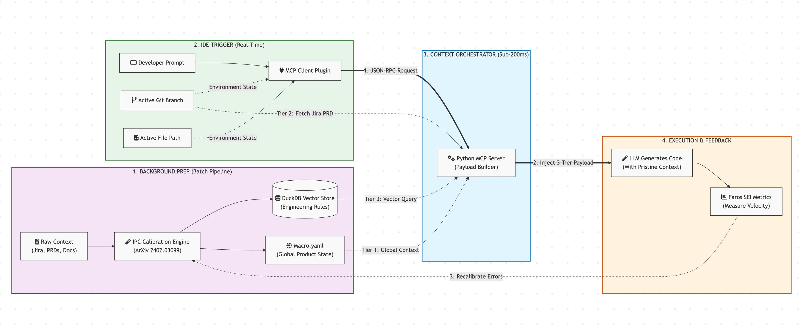

# Faros Context Orchestrator

**Bridging the gap between raw code syntax and enterprise business ROI.**

The Faros Context Orchestrator is a proprietary DevFinOps intelligence layer designed for the Faros AI ecosystem. It utilizes the **Model Context Protocol (MCP)** and a **Tiered Context Strategy** to ensure that AI agents don't just write "correct" code, but write code that is strictly aligned with Faros's strategic moats, capitalization requirements, and historical SEI metrics.

## 💎 Defining "Better": The Context Efficiency Heuristic

The original mission was to create a "better" `AGENTS.md` file. In this solution, we move away from subjective quality and define "Better" ($B$) as a quantifiable **Context Efficiency Heuristic**:

$$B = \frac{A \cdot R}{N}$$

* **$A$ (Alignment):** The degree of adherence to Tier 1 proprietary business logic and product moats.
* **$R$ (Real-time Signal):** The inclusion of high-freshness Tier 2/3 data (active PRDs, Git state, SEI metrics).
* **$N$ (Noise):** The volume of irrelevant tokens passed to the LLM (The "Token Tax").

### Why Orchestration Beats Static Markdown
A static `AGENTS.md` file is a 20th-century solution to a 21st-century AI problem. As projects scale, static files inevitably fail the heuristic:
1.  **Instruction Decay ($N$):** As more rules are added, noise increases, causing the LLM's reasoning to "blur" or ignore critical constraints.
2.  **Stale Signal ($R$):** Documentation cannot reflect live SEI metrics, recent production events, or changing financial metadata.

**The Orchestrator maintains a high $B$ value by using targeted vector retrieval to keep $N$ low and event-driven ingestion to keep $R$ at its maximum.**

---

## 🏗️ Architecture & Data Flow



The Faros Orchestrator functions as a closed-loop system where raw context is calibrated via DSPy, stored in a high-performance DuckDB vector instance, and injected into the LLM's reasoning path in sub-200ms intervals via the MCP server.

---

## 🧠 The 3-Tier Context Strategy

To ensure the LLM has the "Full Picture" of Faros's needs, we inject context in three distinct layers:

| Tier       | Name                          | Source               | Purpose                                                                                                |
| :--------- | :---------------------------- | :------------------- | :----------------------------------------------------------------------------------------------------- |
| **Tier 1** | **Macro Business Directives** | `macro_context.yaml` | High-level product moats and strategic alignment (e.g., Competitive Moat Ground Truth).                |
| **Tier 2** | **Active Environment**        | Git / File Path      | Real-time workspace awareness, including active branch names and current task context.                 |
| **Tier 3** | **Knowledge & Events**        | DuckDB Vector DB     | Specialized coding rules (DRY, SQL Safety) and historical SEI events (e.g., Stripe Migration metrics). |

---

## 🚀 Installation & Usage

### 1. Bootstrap the Environment
```bash
pip install -e .
```
### 2. The Command Chain

* **`faros init`**: Setup the DuckDB schema and VSS extensions.
* **`faros optimize-rules`**: Use **DSPy** to harden raw principles into high-density, vector-ready Markdown.
* **`faros optimize-events`**: Transform raw SEI JSON (like Jira webhooks) into semantic context.
* **`faros ingest`**: Vectorize all Markdown files into the HNSW index.
* **`faros server`**: Launch the FastMCP server for Claude Desktop or Cursor integration.

---

### 📊 SEI & FinOps Integration

The system is natively aware of **Business Value Capital**. By processing SEI events, the Orchestrator identifies CAPEX-eligible tasks. 

If a developer attempts to log effort without the required `cost_center` or `capitalization_category` metadata (as identified in the Tier 3 SEI Event), the Orchestrator will flag the compliance violation in the IDE before the code is even committed.